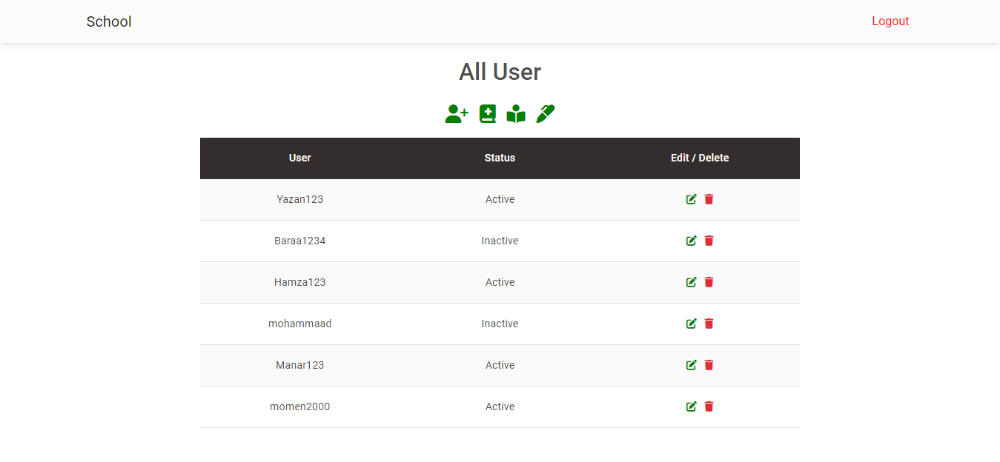
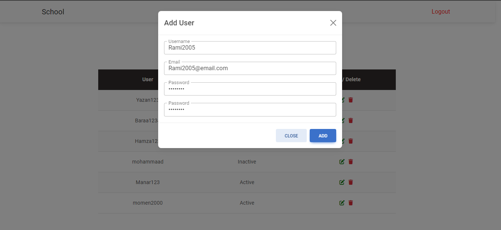
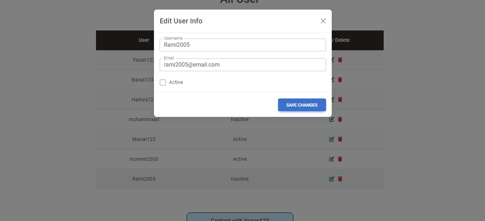
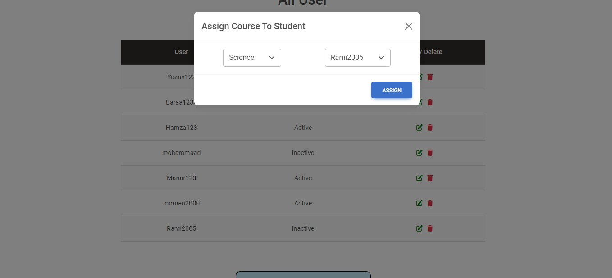
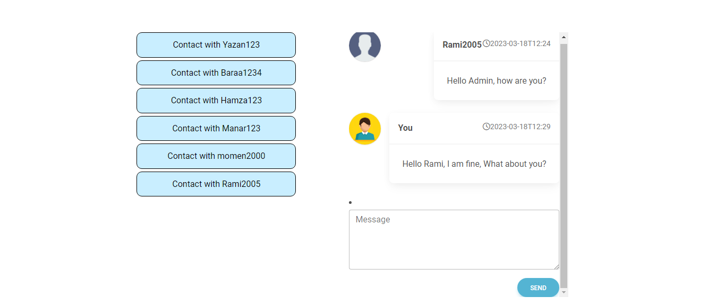

# School Management System

This is a web application for managing students and courses in a school. The application has two roles: admin and student.

As an admin, you can:
- View all students and their information
- Edit student information
- Add new students and courses
- Add students to courses
- Add marks for students in specific subjects
- Communicate with every student through chat messages

As a student, you can:
- View your information
- View all courses you're enrolled in with your marks
- Communicate with the admin through chat messages

The application has a registration and login system to ensure security and privacy.

## Technologies Used

The application was built using:
- Frontend: React.js, Material Design Bootstrap, React Bootstrap, Pure CSS
- Backend: Node.js, Express.js
- Database: MongoDB
- Tools: Postman, MongoDB Atlas

## How to Run the Application

1. Clone the repository
2. Install dependencies using `npm install`
3. Start the server using `npm start`
4. Access the application in your browser at `http://localhost:3000`

## Admin Account

email: admin@admin.com
password: Test@123

## Contributors

- [Mohammad Alfayoume](https://github.com/mohammadalfayoume)

